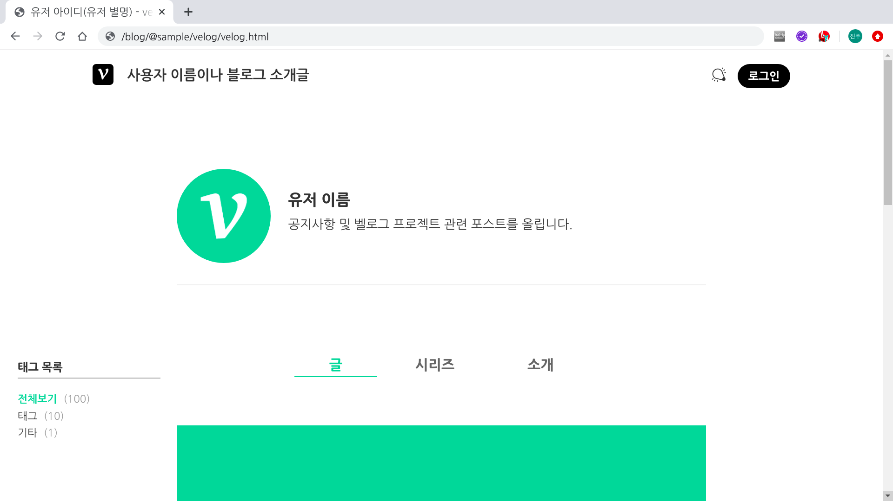
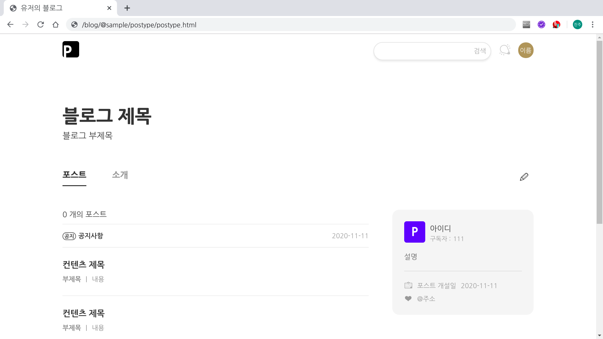
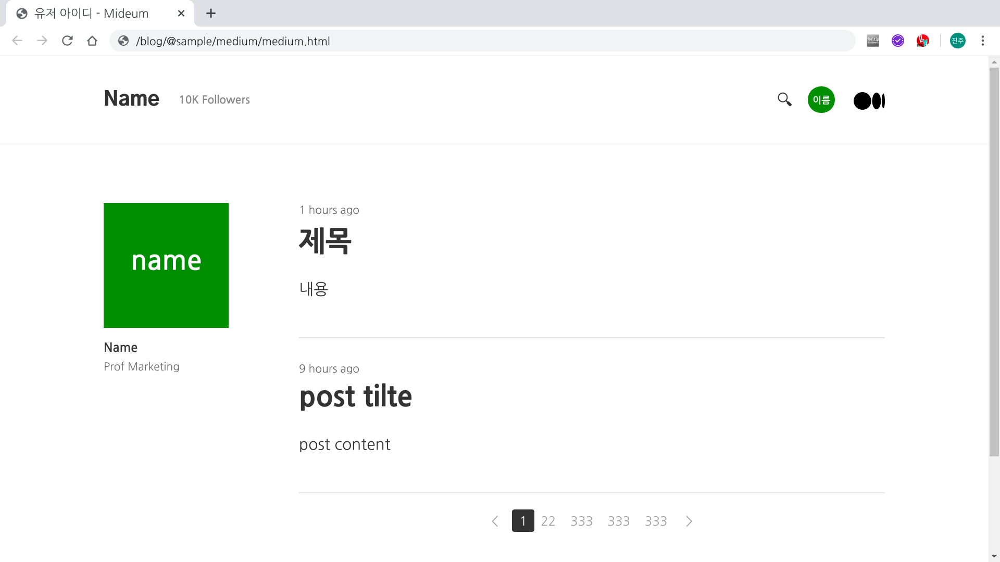

# JS Project

- [vanillajs-velog](./blog/js)
- [react-postype](./blog/react)
- [vue-medium](./blog/vue)

## velog
https://velog.io/

## postype
https://www.postype.com/

## medium
https://medium.com/

[top](#)
